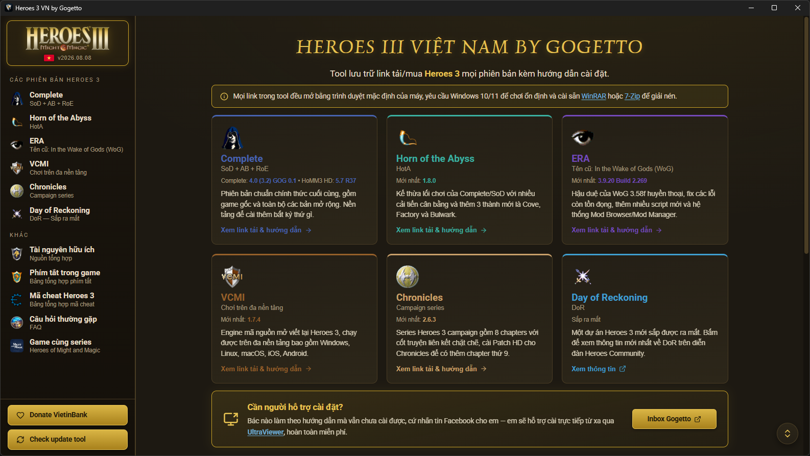
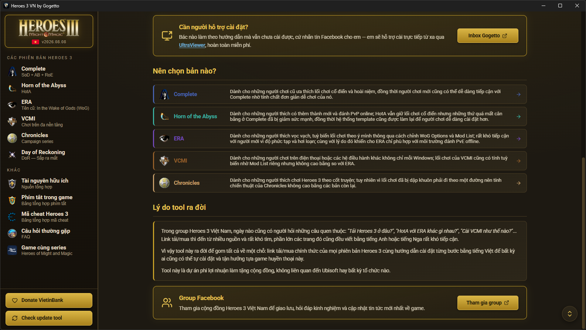
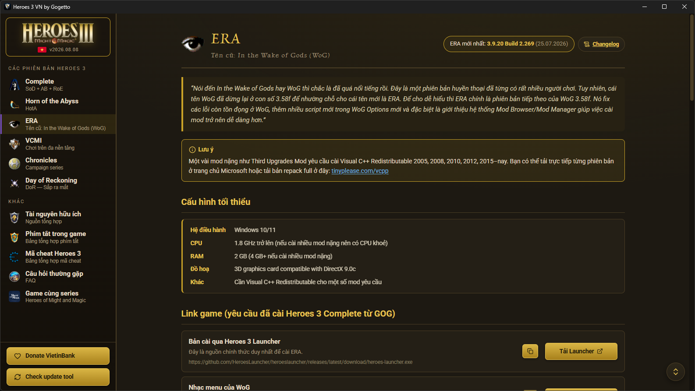
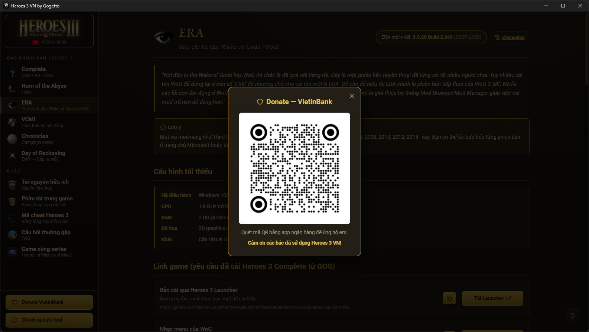

# ⚔️ Heroes 3 VN by Gogetto ⚔️

[](https://github.com/quducute/Heroes3VN/releases) [](https://vi.wikipedia.org/wiki/Microsoft_Windows) [](<https://vi.wikipedia.org/wiki/Android_(h%E1%BB%87_%C4%91i%E1%BB%81u_h%C3%A0nh)>) [](https://vi.wikipedia.org/wiki/Vi%E1%BB%87t_Nam)

<p>
  
  
  
  
</p>

_Tool lưu trữ link tải/mua **Heroes of Might and Magic III** mọi phiên bản kèm hướng dẫn cài đặt bằng tiếng Việt._

---

## 📖 Giới thiệu

**Heroes 3** là một tựa game chiến thuật huyền thoại, nhưng đối với người mới hoặc người chơi cũ mới trở lại, việc tìm đúng chỗ tải game vô cùng rắc rối: **Complete/SoD, HotA, ERA/WoG, VCMI, Chronicles…**, mỗi bản một nguồn tải, một cách cài đặt khác nhau; và để giải quyết vấn đề đó, **Heroes 3 VN** đã ra đời. Mọi thứ đã được gom hết lại về một chỗ, chỉ cần mở tool lên và bấm chọn bản muốn chơi là ra đúng link tải/mua chính thức.

> [!NOTE]
> Tool này chỉ lưu trữ link từ các nguồn chính thức (GOG, trang chủ của mod…), không phát tán file game lậu.

---

## 📥 Tải về

[](https://github.com/quducute/Heroes3VN/releases/latest)

> [!TIP]
> Bấm nút **[MỚI NHẤT]** phía trên hoặc **[Releases](https://github.com/quducute/Heroes3VN/releases/latest)** để vào trang download, sau đó tải file _**`Heroes3VN`**_ mới nhất tương ứng với hệ điều hành đang sử dụng (hiện tại tool đã có mặt trên Windows và Android).

---

## ✨ Tính năng

- Giao diện tool phù hợp với Heroes 3, nhìn là thấy hoài niệm
- Đầy đủ 5 bản Heroes 3 phổ biến nhất kèm hướng dẫn cài đặt chi tiết:
  - **Complete — SoD + AB + RoE**
  - **Horn of the Abyss — HotA**
  - **ERA — tên cũ là In the Wake of Gods (WoG)**
  - **VCMI — engine mã nguồn mở đa nền tảng (Windows, Linux, macOS, iOS, Android)**
  - **Chronicles — series campaign Heroes 3**
- Có mục FAQ giải đáp những thắc mắc của đa số người dùng
- Tài nguyên Heroes 3 phong phú: HoMM3 HD Patch, SoD SP Plugin, template hot (8XM8, 8XM8a, Duel, Jebus Outcast) cùng nhiêu tài nguyên hữu ích khác
- Bảng phím tắt Heroes 3 đầy đủ, tiện lợi cho việc tra cứu và sử dụng
- Bảng mã cheat mọi bản Heroes 3, có thể copy nhanh bằng cách bấm vào mã
- Theo dõi version mới nhất của các bản Heroes 3, tool hiển thị ngay khi có phiên bản mới kèm ngày phát hành
- Mọi link mở bằng trình duyệt mặc định của máy (hoặc copy link để mở bằng trình duyệt tuỳ chọn), đề cao sự an toàn và minh bạch

---

## 🌐 Cộng đồng & Ủng hộ

- **Group Facebook: _<https://www.facebook.com/groups/hero3>_**
- **Donate:** quét mã QR **VietinBank** dưới đây hoặc ở trong tool (nút Donate tại góc trái bên dưới sidebar)


---

## 💻 Mã nguồn

> [!IMPORTANT]
>
> - Mã nguồn được phát hành dưới **giấy phép [MIT](LICENSE)**
> - Yêu cầu **[Node.js](https://nodejs.org) 22+** để chạy (nên cài bản LTS mới nhất)

| Thư mục        | Nền tảng | Công nghệ               |
| -------------- | -------- | ----------------------- |
| **`windows/`** | Windows  | React + Vite + Electron |
| **`mobile/`**  | Android  | React Native + Expo     |

```bash
# B0. Mở Terminal và clone repo về máy (cần cài thêm git nếu máy chưa có)
git clone https://github.com/quducute/Heroes3VN.git
```

### Bản Windows

```bash
# B1. Vào thư mục bản Windows
cd Heroes3VN/windows

# B2. (Tuỳ chọn) Cập nhật dependencies lên phiên bản mới nhất
npx npm-check-updates -u

# B3. Cài dependencies
npm install
```

| Lệnh            | Công dụng                                                     |
| --------------- | ------------------------------------------------------------- |
| `npm run start` | Build rồi mở app test (đầy đủ chức năng)                      |
| `npm run dist`  | Build rồi đóng gói thành 1 file `.exe` portable ra `release/` |

### Bản Mobile

```bash
# B1. Vào thư mục bản Mobile
cd Heroes3VN/mobile

# B2. Cài dependencies (không được update để tránh xung đột với Expo SDK)
npm install

# B3. Cài EAS CLI (để build file cài) và đăng nhập tài khoản Expo
npm install -g eas-cli
eas login
```

| Lệnh                                 | Công dụng                                         |
| ------------------------------------ | ------------------------------------------------- |
| `npx expo start`                     | Chạy dev server để test app qua Expo Go           |
| `eas build -p android -e preview`    | Đóng gói file `.apk` để cài trực tiếp vào máy     |
| `eas build -p android -e production` | Đóng gói file `.aab` để đưa lên Google Play Store |

---

## ©️ Credits

**Ubisoft Entertainment S.A.** là đơn vị nắm giữ bản quyền trò chơi **Heroes of Might and Magic III**. **Heroes 3 VN** chỉ là một dự án phi lợi nhuận làm tặng cộng đồng và không liên quan đến bất kỳ tổ chức nào.

---

_**❤️ From [Gogetto](https://www.facebook.com/qudu.Gogetto) with love!**_
